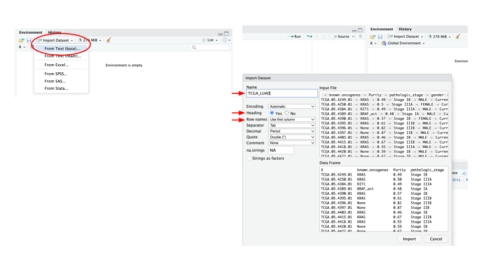
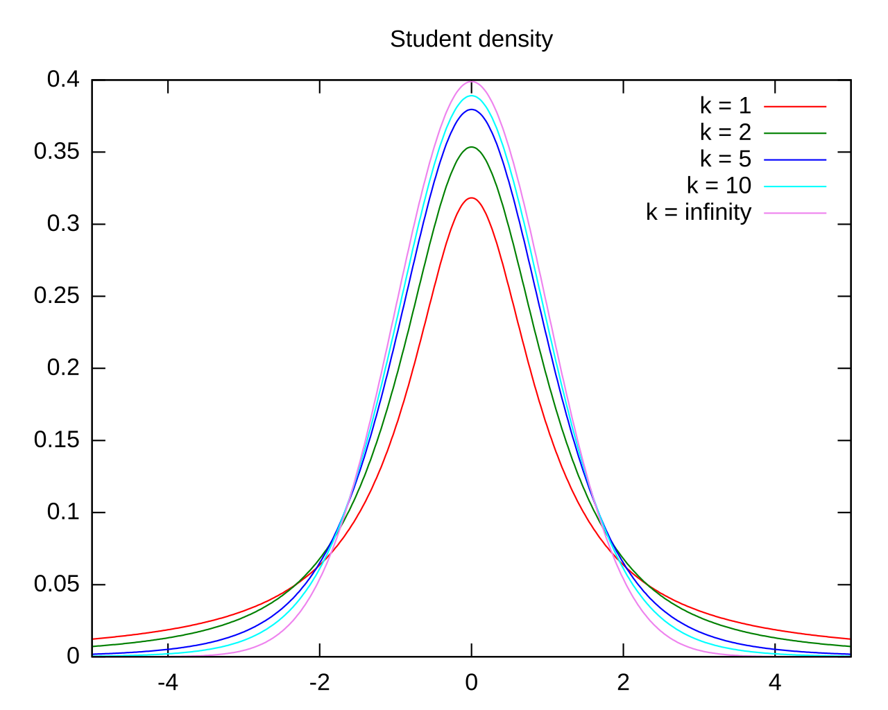

```{=html}
<style>
details > summary {
  padding: 4px;
  width: 400px;
  background-color: #eeeeee;
  border: none;
  box-shadow: 1px 1px 2px #bbbbbb;
  cursor: pointer;
}

details > p {
  background-color: #E0F8EC;
  padding: 4px;
  margin: 0;
  box-shadow: 1px 1px 2px #bbbbbb;
}
header h1 {
      font-size: 70px;
      font-weight: 600;
      font-palette: tomato;
    }
</style>
```

```{r, setup, echo=F, warning=FALSE,message=FALSE}
require("knitr")
library(readr)
library(tidyverse)
library(FSA)
library(corrplot)
clinical_data <- read_csv("Datasets/clinical_data.csv")
```

# Objectives

The purpose of this section is to provide you with the basics needed to analyze biological data using simple statistics. The main objective is to provide you with the tools to :

-   Choose a statistical method appropriate for a biological question
-   Interpret the results correctly
-   Analyse data with R

# Discover and explore data : `clinical_data`

## Load the data

First step to do is to load our dataset called `clinical_data` in our R environment. You can follow the instruction below.

{fig-align="center"}

## Description of the data

The first thing to do before starting the analysis is to observe the dataset in order to define the structure and type of data. You can do it by hand, or you can use R and some functions already built in, without installing any packages.

### `head`

The first function you can use is `head`. It will returns the **first** (or **last** with `tail`) **rows** of your dataset. By default, **the 6 first (or last) rows** will be returned.

```{r head}
#| code-fold: false
head(clinical_data)
```

### `str`

The function `str` allows to display the **internal structure** of the data. Using this method, we can see the **dimensions** of our dataset, i.e., the number of rows and columns. Here we have **150 rows and 10 columns**. You can also see what **type** each column is, like **numerical** or **character**.

Thanks to this view, we can define more precisely what **type of data** we are dealing with. ([See the descriptive statistics part](./descriptive_stats.html))

```{r str}
#| code-fold: false
str(clinical_data)
```

### `summary`

The `summary` function is very useful because it provides **descriptive statistical results**, as seen in the previous section. For each column, we will find the **median**, the **mean**, and the **quartiles**, among other things.

```{r summary}
#| code-fold: false
summary(clinical_data)
```

# Study 1 : *Do patients with heart disease have a higher heart rate than patients with no particular disease ?*

## First visualisation

We can start by making a simple observation using a **boxplot** of **heart rate** based on **diagnosis** :

```{r, eval=F}
ggplot(data = clinical_data, aes(x=diagnosis, y = heart_rate)) +
  geom_boxplot() + 
  labs(x="Diagnosis", y = "Heart rate") +
  theme_bw()
```

```{r, echo=F}
ggplot(data = clinical_data, aes(x=diagnosis, y = heart_rate)) +
  geom_boxplot() + 
  labs(x="Diagnosis", y = "Heart rate") +
  theme_bw()
```

Based on this initial visualization, we can see that there appears to be a **difference in heart rate among patients with heart disease**.

## Hypotheses : decision support

A statistical approach is based on reasoning with **two initial solutions** called working **hypotheses**. We find the **null hypothesis** (H0) and the **alternative hypothesis** (H1).

-   *Null hypothesis* (H0) : corresponds to the **initial assumption**; this hypothesis seeks to confirm that there are **no differences**, for example.
-   *Alternative hypothesis* (H1) : is the opposite, it suggests that **there is a difference or an effect**.

*In our case, what would be the hypotheses ?*

<details>

<summary>Working hypotheses about our question</summary>

H0 = **The average heart rate is not different or lower in patients with heart disease than in patients with no disease**.

H1 = **The average heart rate is higher in patients with heart disease**.

</details>

In our question, and therefore in our assumptions, there is the notion of **“higher".** The biological question is therefore **directional**. So we will be in a situation where we will be on a **one-tailed test**.

## Independent or paired ?

This is an important point when doing **statistics**. It is important to know whether our data is **independent** or **paired**.

-   *Independent* : The choice of elements in the first sample has no influence on the choice of elements in the second sample.

-   *Paired* : The choice of elements in the first sample influences the choice of elements in the second sample.

*What would it be in our case ?*

<details>

<summary>Independent or paired data ?</summary>

All patients in our dataset are **different** from each other and were not selected based on others, so we can say that our samples are **independent**.

</details>

## Choice of the test

There are many statistical tests available, and it is easy to get confused. Depending on the **biological question** being asked and also on the **data itself**, one test will be used rather than another.

Based on our question, we will seek to **compare groups**, in this case one diagnostic group (**heart disease**) versus the **other diagnostic groups**. So we will compare two possibilities.

Now the question we must ask ourselves is : **Are we trying to compare averages, distributions, proportions, etc.?**

<details>

<summary>Response</summary>

To answer our question, we will compare the two groups of patients, `Heart Disease` and `No Disease`; using the variable `heart_rate` by comparing the **mean** for each group.

</details>

### Compare means

To compare means, there is a determination key for choosing the right test based on the data. There are two keys depending on whether the samples are independent or paired.


{fig-align="center"}

{fig-align="center"}

Based on those information, what should we use as a determination key ?

<details>

<summary>Response</summary>

As we identified above, we are working with **independent samples**. The aim is to compare the **average heart rates** between **patients with heart disease** and **other patients** (2 group). We will start with **the key for independent samples**.

</details>

### Conditions of application

Some tests require certain **conditions** to be verified. These are called **parametric tests** (as opposed to **non-parametric tests**). 

**Parametric tests** are calculated under the **assumption** that the population from which the data (samples) are drawn was **normally distributed**, as this is the **most common distribution in nature**.

#### **Normality**

The first **condition of application** that we seek to verify is **normality**. To check normality, the first thing we can do is look at how the data we are interested in is **distributed**, graphically.

##### *Histogram*

Here, we will look at the distribution of heart rates in patients in general.

```{r, eval = F}
hist(clinical_data$heart_rate,
     main = "Heart rate from all patients",
     col = "red",
     xlab = "Heart rate")
```

```{r, echo=F}
hist(clinical_data$heart_rate,
     main = "Heart rate from all patients",
     col = "red",
     xlab = "Heart rate")
```

How can this histogram be interpreted?

<details>

<summary>Response</summary>

You have to look at the **shape of the distribution**. If the data approximates a **normal distribution**, then you will see **symmetry** in the data with a **bell shape**.\
In our case, there seems to be a symmetry emerging with this bell shape : **we can therefore say that the data appear to follow a normal distribution**.

</details>


##### *Q-Q plot*

A **quantile-quantile** (Q-Q) plot is used to check whether a data set follows a **theoretical distribution**. We do not **compare the data directly**, but rather **their position in the distribution** that we observe.

For example, in our case, we will classify the **heart rate values for all patients in ascending order** and associate each value with **the corresponding quantile** (10%, 25%, 50%, etc.). For this same **quantile**, we look at what it corresponds to in the **theoretical distribution** (normal distribution in our case).

To be more specific: **the median corresponds to the 50% quantile, which corresponds to 0 in a normal distribution**.

The closer the observed quantiles are to the theoretical quantiles, the closer our data is to a normal distribution.

```{r, eval=F}
# Q-Q plot with qqnorm function (equivalent of qqplot but for normality)
qqnorm(clinical_data$heart_rate)
qqline(clinical_data$heart_rate)
```

```{r, echo=F}
qqnorm(clinical_data$heart_rate)
qqline(clinical_data$heart_rate)
```

What can be said about this plot?

<details>

<summary>Response</summary>

Despite **slight discrepancies** in the most extreme values, the **observed quantiles appear to follow the theoretical quantiles**. This allows us to hypothesize that **the heart rate values of all patients appear to follow a normal distribution**.

</details>

##### *Statistical approach to check normality*

To check for statistical normality, there is a test called the **Shapiro-Wilk test**.

This tool allows you to test whether a **distribution deviates significantly from a normal distribution**. It is the element that completes the graphical inspection.

As with any statistical analysis, we start with an **initial hypothesis** that we seek to verify through testing.

-   **H0** : the data **follow a normal distribution**
-   **H1** : the data **do not follow a normal distribution**

If the p-value obtained via the Shapiro test is less than 0.05, then we can **reject the null hypothesis H0**.

NOTE: **Rejecting H0 means that we detect a statistical difference between our data and the Normal distribution**.

```{r, eval=F}
# Test normality for patients with heart disease
shapiro.test(clinical_data$heart_rate)
```

**Shapiro-Wilk test on the heart rate variable for all patients :**

```{r, echo=F}
shapiro.test(clinical_data$heart_rate)
```

*How can we interpret those results ?*

<details>

<summary>Response</summary>

We consider that we set a standard **threshold of 5%** (i.e., 0.05). Here, both tests give **p-values that are greater than 0.05** : **we can't reject H0**.
This means that we **do not detect any significant deviation from normality**. In this case, we can move on to a **parametric test, i.e., Student's t-test**.

</details>

#### **Homogeneity of variances**

This is the **second condition of application** that we need.

When **comparing means between groups**, it is assumed that the **variability** of the measurements is **comparable** in each group. This means that the **differences** observed are **not due to one group** being **much more variable than the other**.

The first check we can do is graphically, with **boxplots** like we did earlier.

```{r, eval=F}
ggplot(data = clinical_data, aes(x=diagnosis, y = heart_rate)) +
  geom_boxplot() + 
  labs(x="Diagnosis", y = "Heart rate") +
  theme_bw()
```

```{r, echo=F}
ggplot(data = clinical_data, aes(x=diagnosis, y = heart_rate)) +
  geom_boxplot() + 
  labs(x="Diagnosis", y = "Heart rate") +
  theme_bw()
```

Thanks to this simple representation, we can look at the **appearance of the boxplots**.

-   Are the sizes comparable?
-   Are there any outliers?
-   Are the whiskers similar in size or very different?

*What do you think about variability here ?*

<details>

<summary>Response</summary>

What we observe here is that, overall, **the box and whisker sizes seem a little different**. But the difference remains light and we would expect to see differences between the groups.

</details>

For the homogeneity of variances, we can check statistically too with a **Fisher test**. This test is used **to determine whether two groups exhibit comparable variability**. **Are the measurements more scattered in one group than in the other ?**

We then make the following assumption :

-   **H0** : the variances of **the two groups are equal**
-   **H1** : the variances are **different**

If the p-value obtained is less than 0.05, then we can reject **the null hypothesis H0**.

```{r, eval=F}
# Test homogeneity of variances between patients with heart disease and no disease.
var.test(
    clinical_data$heart_rate[clinical_data$diagnosis == "Heart Disease"],
    clinical_data$heart_rate[clinical_data$diagnosis == "No Disease"]
)
```

```{r, echo=F}
var.test(
    clinical_data$heart_rate[clinical_data$diagnosis == "Heart Disease"],
    clinical_data$heart_rate[clinical_data$diagnosis == "No Disease"]
)
```

*How can we interpret those results ?*

<details>

<summary>Response</summary>

The test gives a **p-value that is larger than the threshold of 0.05**, it is not significant : **we can't reject H0**.
It means that we don't detect a statistical difference between variances. According to the **determination key**, we **can directly apply Student's t-test**, without correction.

</details>

## Student t-test

As you now understand, before embarking on a test, we seek to understand what we are **comparing** and what we would **expect** from the test (hypotheses).

### Principle

First, let's explain what the **Student's t-test** is. As a reminder, this test allows you to **compare the means** of two samples (independent or paired). 
Between two samples, we can expect the **averages to fluctuate**. But what we want to know through this test is whether **this fluctuation is due to sampling error**. 

### t-value

To do this, the test relies on a **t-value** calculated by taking into account the **difference in means** and the **expected variability of this difference between samples**.
The test will compare the **calculated t-value** to a **theoretical t-value** based on the known **Student's distribution**, with a certain **degree of freedom** (noted k in the figure below).

{fig-align="center"}

### Welch's correction

If the variances are too different, we will use **Welch's correction**, which **no longer assumes that the variances are equal**.
To put it simply, correction allows you to **adjust the degree of freedom** based on variance deviations and the number of samples. 

### Hypotheses

As a reminder, our question is whether patients with heart disease have a higher heart rate than those with other diagnoses. In this question, there is a notion of “higher”, which implies a direction. It is not simply a question of whether there is a difference. 

- **H0** : The average heart rate **is not different** in patients with heart disease than in patients with no disease.
- **H1** : The average heart rate **is higher** in patients with heart disease.

```{r, eval=F}
# Student t-test 
t.test(
  x = clinical_data$heart_rate[clinical_data$diagnosis == "Heart Disease"],
  y = clinical_data$heart_rate[clinical_data$diagnosis == "No Disease"],
  alternative = "greater",
  var.equal = TRUE
)
```

<details>

<summary>About the code above</summary>

To do the test, we use the function `t.test()`. In the function we have several arguments :

  - **x** and **y** =  The two groups we want to compare.
  - **alternative** = What kind of orientation our question has ? In simple words, here, we want to know if a group is greater than the other. So we precise `alternative = "greater`. If we were only looking for a difference regardless of direction, we would have put `alternative = "two.sided"`.
  - **var.equal** = It allows you to specify whether the variances between groups are equal or not. This argument is, by default, on `FALSE`. This means that by default, the `t.test()` function applies a Welch's correction.

</details>

```{r, echo=F}
# Student t-test
t.test(
  x = clinical_data$heart_rate[clinical_data$diagnosis == "Heart Disease"],
  y = clinical_data$heart_rate[clinical_data$diagnosis == "No Disease"],
  alternative = "greater",
  var.equal = TRUE
)
```

*How can we interpret those results ?*

<details>

<summary>Response</summary>

The test gives a **p-value that is smaller than the threshold of 0.05**, it is significant : **we reject H0**. 
It means that we detect a statistical difference between the means : **the patients with heart disease have a higher heart rate compared to patients with no disease**.

</details>


# Study 2 : *Does the glucose level differ depending on the diagnosis?*

## First visualisation

As we did for the **heart rate**, You can look at the average **glucose** level for each **diagnosis** :

```{r, eval=F}
ggplot(data = clinical_data, aes(x=diagnosis, y = glucose)) +
  geom_boxplot() + 
  labs(x="Diagnosis", y = "Glucose") +
  theme_bw()
```

```{r, echo=F}
ggplot(data = clinical_data, aes(x=diagnosis, y = glucose)) +
  geom_boxplot() + 
  labs(x="Diagnosis", y = "Glucose") +
  theme_bw()
```

Compared to the first case study, the question is **posed slightly differently**. In fact, we start without any **preconceptions** (even if we suspect something when looking at the data), and we seek to **determine the difference in average glucose levels between the groups** in order to potentially identify **whether one or more groups are different**.

## Compare means : but how ?

Even if the question is not asked in the same way, the answer seems to be the same: **compare the average glucose level** between **each diagnosis**, 2 by 2. And that's pretty much what we're going to do.

So we could say to ourselves: **“I'm going to do a Student's t-test or a Wilcoxon test for each combination!”**
That would be possible here, but imagine if we had 20 different diagnoses—it would take a very long time.

Fortunately, there are methods that allow us to **explain a quantitative variable** (in this case, glucose) using a **qualitative variable with several modalities** (diagnosis, with four different diagnoses).

This will initially allow us to see if there is **an overall difference**, and then to go into **detail to see where the difference(s) lies**.

{fig-align="center"}

## Analysis

### Hypotheses

  - H0 = **The mean of glucose across the different diagnoses are equal (no difference)**
  - H1 = **At least one glucose mean from one diagnosis differs from the other groups.**

### Normality 

As we saw earlier, we need to test the normality of our data in order to determine whether to use a parametric (ANOVA) or nonparametric (Kruskal-Wallis) test.

  - H0 = The data **follow a normal distribution**
  - H1 = The data **does not follow a normal distribution**
  
```{r, eval=F}
# Q-Q plot with qqnorm function (equivalent of qqplot but for normality)
qqnorm(clinical_data$glucose)
qqline(clinical_data$glucose)
```

```{r, echo=F}
qqnorm(clinical_data$glucose)
qqline(clinical_data$glucose)
```
  
  
```{r, eval=F}
# Test normality about glucose
shapiro.test(clinical_data$glucose)
```

**Shapiro-Wilk test on the glucose variable:**
```{r, echo=F}
shapiro.test(clinical_data$glucose)
```

*How do you interpret those results about normality ?*

<details>

<summary>Response</summary>

Initially, the **quantile-quantile plot analysis** allows us to observe a **deviation in the most extreme values**, which would indicate that **the distribution of our data probably does not follow a normal distribution**.
This trend is confirmed by the Shapiro test, which gives us a **significant p-value** (below the threshold of 0.05).
In this case, **we cannot reject H0** and we can consider that the **glucose-related data does not follow a normal distribution**.

</details>

### Testing the hypothesis

First, we will see if at least one of the groups differs in terms of glucose levels or if all groups are equivalent in this aspect.

```{r, eval=F}
# Kruskal-Wallis test
kruskal.test(glucose ~ diagnosis, data = clinical_data)
```

```{r, echo=F}
# Kruskal-Wallis test
kruskal.test(glucose ~ diagnosis, data = clinical_data)
```

*What can you say about this result ?*

<details>

<summary>Response</summary>

The p-value is **below the threshold of 0.05**, which means that it is **significant**. We therefore **reject H0** and consider that **at least one group has a higher or lower glucose level**.

</details>

### Post-Hoc test

Post-hoc in Latin means **“after that”**. This is a category of tests that come after other tests that reveal **a trend**, such as **ANOVA**. Post-hoc tests allow **these trends to be explored** in greater detail in order to draw **more accurate conclusions**.
It is necessary to use the **post-hoc test appropriate** for the test we used previously.
Since we performed a **Kruskal-Wallis test**, we will use **Dunn's post-hoc test**.

To be rigorous, before embarking on the post-hoc test, we can make the same assumption for each comparison:

  - H0 = **There is no difference in average glucose levels between diagnosis A and diagnosis B***
  - H1 =  **There is a difference in average glucose levels between diagnosis A and diagnosis B***
  
*A and B being different diagnoses listed in the `diagnosis` column*

```{r, eval=F}
# Install the FSA package
install.packages("FSA")
# Activate the package
library(FSA)

# Dunn post-hoc
dunnTest(glucose ~ diagnosis, data = clinical_data)
```

```{r, echo=F}
dunnTest(glucose ~ diagnosis, data = clinical_data)
```

The result of a post-hoc test is almost always presented as follows. We have **each comparison that was made between the different groups**. And for each comparison, we obtain several pieces of information, including the **p-value** and the **adjusted p-value**. 

*How to interpret it ?*

<details>

<summary>Response</summary>

We note that three comparisons, **all with the diagnosis of diabetes**, are **significant** with a p-value less than 0.05.
For these comparisons, **H0 is rejected**, and we can therefore consider that there is indeed a **difference between patients with diabetes and other patients**.
For the other comparisons, since the p-value is **not significant**, we **cannot reject H0**; there does not appear to be **any difference between these groups**.

**We can conclude that patients with diabetes have higher glucose levels than other patients.**

</details>

# Study 3 : *Is there a link between age and heart rate?*

## First visualisation

As with any study, it is important to observe the data graphically before embarking on statistical tests.
Unlike the other two cases, we will simply plot the data as points to see if there is a trend linking the `age` variable with the `heart rate` variable.

```{r, eval=F}
plot(clinical_data$age, clinical_data$heart_rate, 
     xlab = "Age", 
     ylab = "Heart rate")
```

```{r, echo=F}
plot(clinical_data$age, clinical_data$heart_rate, 
     xlab = "Age", 
     ylab = "Heart rate")
```

## Correlation

When we try to **explain one quantitative variable** using **another quantitative variable**, we call this **correlation**.
It is also possible to perform **linear regression** when the usual conditions of application are met.
We refer to **simple linear regression** when seeking to understand the relationship between two quantitative variables, and **multiple linear regression** when seeking to explain a quantitative variable using several quantitative variables.

{fig-align="center"}

There are **three types** of correlation :

  - **Positive correlation** : the two variables have a **direct relationship**. **When one variable increases, the other also increases**. The **r correlation coefficient** is close to 1.

```{r, echo=F}
set.seed(123)

# Simulate data
n <- 100
x_pos <- rnorm(n, 0, 1)
y_pos <- 2 * x_pos + rnorm(n, 0, 0.5)

# Plot
plot(x_pos, y_pos,
     main = "",
     xlab = "X",
     ylab = "Y",
     pch = 19,
     col = "blue")
abline(lm(y_pos ~ x_pos), col = "red", lwd = 2)
```

  - **Negative correlation** : the two variables have an **inverse relationship**. **When one variable increases, the other one decreases**.  The **r correlation coefficient** is close to -1.
  
```{r, echo=F}
set.seed(123)

# Simulate data
x_neg <- rnorm(n, 0, 1)
y_neg <- -2 * x_neg + rnorm(n, 0, 0.5)

# Plot
plot(x_neg, y_neg,
     main = "",
     xlab = "X",
     ylab = "Y",
     pch = 19,
     col = "darkgreen")
abline(lm(y_neg ~ x_neg), col = "red", lwd = 2)
```
  
  - **No correlation** : the two variables have **no relationship**. **A change in one variable does not affect the other**.  The **r correlation coefficient** is around 0.
  
```{r, echo=F}
set.seed(123)

# Simulate data
x_none <- rnorm(n, 0, 1)
y_none <- rnorm(n, 0, 1)

# Plot
plot(x_none, y_none,
     main = "",
     xlab = "X",
     ylab = "Y",
     pch = 19,
     col = "purple")
abline(lm(y_none ~ x_none), col = "red", lwd = 2)
```

The correlation coefficient provides direction as well as strength:

| r         | Correlation strength      |
|-----------|---------------------------|
| 0 < 0.1   | No correlation            |
| 0.1 < 0.3 | Weak correlation          |
| 0.3 < 0.5 | Medium correlation        |
| 0.5 < 0.7 | Strong correlation        |
| 0.7 < 1   | Very strong correlation   |

## Analysis

### Hypotheses

  - H0 = **The variables `heart_rate` and `age` are not related**.
  - H1 = **The variables `heart_rate` and `age` are related to each other**.

### Normality

  - H0 = The data **follow a normal distribution**
  - H1 = The data **does not follow a normal distribution**
  

**Ages in all patients :**
```{r, eval=F}
# Q-Q plot with qqnorm function (equivalent of qqplot but for normality)
qqnorm(clinical_data$age)
qqline(clinical_data$age)
```

```{r, echo=F}
qqnorm(clinical_data$age)
qqline(clinical_data$age)
```

```{r, eval=F}
# Test normality about age
shapiro.test(clinical_data$age)
```

```{r, echo=F}
shapiro.test(clinical_data$age)
```


**Heart rates in all patients :**

```{r, eval=F}
# Q-Q plot with qqnorm function (equivalent of qqplot but for normality)
qqnorm(clinical_data$heart_rate)
qqline(clinical_data$heart_rate)
```

```{r, echo=F}
qqnorm(clinical_data$heart_rate)
qqline(clinical_data$heart_rate)
```

```{r, eval=F}
# Test normality about heart rate
shapiro.test(clinical_data$heart_rate)
```

```{r, echo=F}
shapiro.test(clinical_data$heart_rate)
```

*How do you interpret those results about normality ?*

<details>

<summary>Response</summary>

In the **quantile-quantile plot analysis** we don't observe deviations , which would indicate that **the distribution of our data probably does follow a normal distribution**.
This trend is confirmed by the Shapiro test, which gives us a **non-significant p-value** (above the threshold of 0.05).
In this case, **we reject H0** and we can consider that the **data follow a normal distribution**.

</details>

### Testing the hypothesis

Based on the above determination key, we can therefore proceed with a **Pearson correlation test**.

```{r, eval=F}
# Pearson correlation
cor.test(clinical_data$age, clinical_data$heart_rate, method = "pearson")
```

```{r, echo=F}
cor.test(clinical_data$age, clinical_data$heart_rate, method = "pearson")
```

*What can you say about this result ?*

<details>

<summary>Response</summary>

When representing the two variables, it was initially noted **that no correlation trend appeared to emerge**. 
Pearson's correlation confirms this trend with a **correlation coefficient close to 0** (**r = 0.13**). Furthermore, the **p-value is not significant** (p>0.05), so we **cannot reject the null hypothesis H0** and therefore conclude that the variables `heart_rate` and `age` are not correlated.

</details>

## To go further about correlation

### Correlation vs causality

Correlation should not be confused with **causation**. When two variables are **strongly correlated**, we tend to say: “**My variable A is influenced by my variable B**.” A correlation analysis **cannot determine** whether there is a **cause-and-effect relationship** between two variables.

*For example, we could easily find a correlation between ice cream consumption and the number of swimming accidents in the summer. However, despite this correlation, this does not mean that eating ice cream causes swimming accidents.*

**It is important to keep in mind that a positive or negative correlation may be the result of chance.**

### Correlation in R

For our question, we only looked at the correlation between two quantitative variables in our dataset. It is also possible to perform a **more exploratory analysis** that **compares each quantitative variable with each other**.

To do this, **we must work with quantitative variables** and the very first step is to graphically **visualize the relationship** between variables using a **scatterplot**.

```{r, eval=F}
# Multiple scatterplots
pairs(clinical_data %>% select(where(is.numeric), -patient_id))
```

```{r, echo=F}
# Multiple scatterplots
pairs(clinical_data %>% select(where(is.numeric), -patient_id))
```

Then there is a function called `cor()` that calculates each correlation coefficient between the variables.

```{r, eval=F}
# Correlation between every quantitative variable (numeric)
clinical_data %>%
  select(where(is.numeric)) %>% # Select only numeric columns
  cor(method = "spearman", use = "pairwise.complete.obs") # cor() function
```

```{r, echo=F}
# Correlation between every quantitative variable (numeric)
clinical_data %>%
  select(where(is.numeric)) %>% # Select only numeric columns
  cor(method = "spearman", use = "pairwise.complete.obs") # cor() function
```

As you can see in the method parameter, we use **Spearman's correlation coefficient** rather than **Pearson's**. As a reminder, **Spearman's method is a non-parametric method** that does not assume normality and is much **less sensitive to extreme values**.
When we have many variables with many values, it is easier to use this method.

As for the `use` parameter, it is important because it defines the **rules for using data when it is missing**. With the `pairwise.complete.obs` argument, we define that only pairs of values between variables where there is **no missing data will be used**.

It is also possible to display the coefficients in color in a **correlation plot graph**.

```{r, eval=F}
# Correlation plot between every quantitative variable (numeric)
corrplot(clinical_data %>%
             select(where(is.numeric)) %>% # Select only numeric columns
             cor(method = "spearman", use = "pairwise.complete.obs"), # cor() function
         method = "number", # display coef directly
         type = "upper") # display only upper part 
```

```{r, echo=F}
# Correlation plot between every quantitative variable (numeric)
corrplot(clinical_data %>%
             select(where(is.numeric)) %>% # Select only numeric columns
             cor(method = "spearman", use = "pairwise.complete.obs"), # cor() function
         method = "number", # display coef directly
         type = "upper") # display only upper part 
```

# Study 4 : *"Is the proportion of smokers different between patients with heart disease and patients with no disease?"*

## First visualisation

Unlike the other cases we have studied, we can simply create a **table**, called a **contingency table**, which will allow us to count the number of people who smoke or do not smoke in each group.

```{r, eval=F}
# Contingency table
tab <- table(
     clinical_data$smoking_status[clinical_data$diagnosis %in% c("Heart Disease", "No Disease")],
     clinical_data$diagnosis[clinical_data$diagnosis %in% c("Heart Disease", "No Disease")]
     )
```

```{r, echo=F}
# Contingency table
table(
     clinical_data$smoking_status[clinical_data$diagnosis %in% c("Heart Disease", "No Disease")],
     clinical_data$diagnosis[clinical_data$diagnosis %in% c("Heart Disease", "No Disease")]
     )
```

## Compare proportions

When comparing numbers of **individuals** or **proportions**, we compare **two or more qualitative variables where there are two or more classes**.

{fig-align="center"}

## Analysis

### Hypotheses

  - H0 = **The proportion of smokers is the same in both groups**
  - H1 = **The proportion of smokers is different**
  
### Cochran theorem

**Cochran's rule** is a theorem that requires **a minimum sample size of 5 to be respected for each class** in the contingency table. In our case, we do have more than 5 patients in each class. We can then use the **chi-square homogeneity test**.

### Testing the hypothesis

```{r, eval=F}
# Chi-square homogeneity test
chisq.test(tab)
```

```{r, echo=F}
# Chi-square homogeneity test
tab <- table(
     clinical_data$smoking_status[clinical_data$diagnosis %in% c("Heart Disease", "No Disease")],
     clinical_data$diagnosis[clinical_data$diagnosis %in% c("Heart Disease", "No Disease")]
     )

chisq.test(tab)
```

*How do you interpret this result ?*

<details>

<summary>Response</summary>

The test gives us a **p-value greater than 0.05**, so it is **not significant**. This **does not allow us to reject H0**, and therefore we can say that **the proportions of smokers and non-smokers are the same among those with heart disease and those without**.

</details>